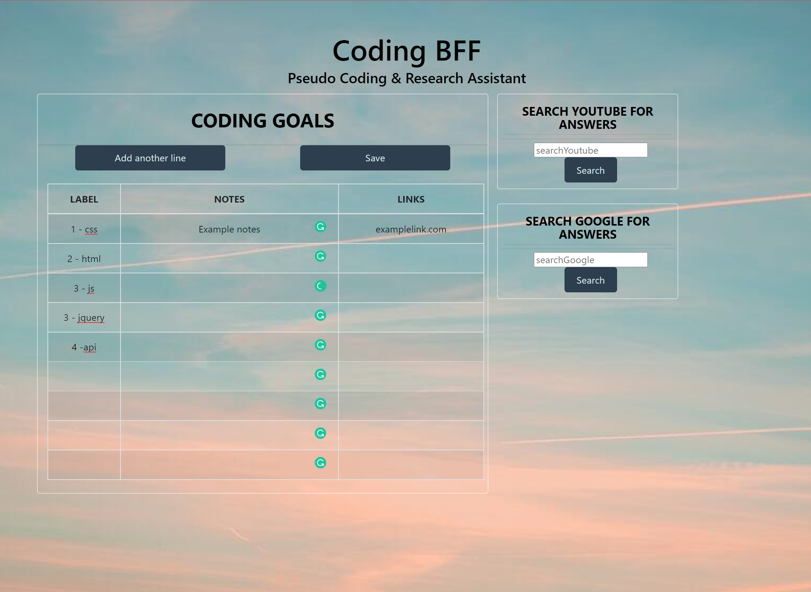

# Alpha-1-Prime
Team Project 1

https://kashane1.github.io/alpha-1-prime/

## User Story
As a Coding BFF user
I want an organizational tool with embedded web searching features
So that my tasks can be completed within one window and remain organized effectively 

What was our motivation?
Wanting to minimize the amount of browser tabs that we open.
Organizing our work and our research into one location.
Having quick links and resources to ideas we already learned.

Our motivation is to remove the overwhelming amount of information out there and bring it down to bite size pieces of information. Sometimes its not that we all can't find the right answers, but it's that there are too many answers out there for us to look at. Our application helps individuals focus their workload in order to complete their overall tasks more efficiently. 

## Acceptance Criteria
Given a coding planner with interactive features
I am presented multiple lines where I can input my goals/tasks

When Google API is searched
Results are shown in a modal on the page
Search Results are clickable and can be saved to planner

When Youtube API is searched
It behaves like searching the youtube website
Videos are able to be played within the same window
Video links can be transferred over to planner 

## Process

Challenges: 

Getting the YouTube video to play in the modal was a huge challenge and thankfully we got some help from Jeff.

A few conflicts came up when we merged some of our branches, but we were able to figure out why very easily. 

Local Storage for an entire table was a little tricky, but we worked it out as a team.